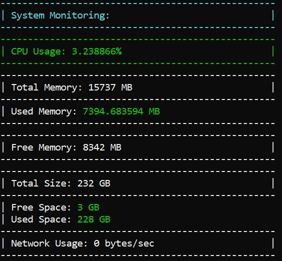

# System-Monitoring-System in c++

Overview

This is a System Monitoring Utility designed for Windows environments. It provides real-time monitoring of system metrics including CPU usage, memory usage, disk usage, and network usage. The utility also logs data to a file and displays hardware information.
Features

    Real-time System Monitoring: Monitors CPU, memory, disk, and network usage.
    Logging: Optionally logs monitoring data to a file.
    Hardware Information: Displays information about the processor and memory.
    Drive Listing: Lists all logical drives on the system.
    Customizable Console Output: Customizes font size, text color, and output formatting.

Prerequisites

    Operating System: Windows
    Libraries: pdh.lib (Windows Performance Data Helper)

Installation

    Clone the Repository:

    bash

git clone https://github.com/yourusername/system-monitoring-utility.git
cd system-monitoring-utility

Build the Project:

    Using Visual Studio:
        Open the project in Visual Studio.
        Build the solution (usually Build > Build Solution).

    Using Command Line:
        Ensure you have a C++ compiler installed (e.g., MSVC).
        Compile the project using:

        bash

            cl /EHsc system_monitoring_utility.cpp /link /LIBPATH:C:\path\to\pdh.lib

Usage

    Run the Program:
        Open the compiled executable (e.g., system_monitoring_utility.exe).

    Choose an Option from the Main Menu:
        Sys: Open live system monitoring.
        File: Save current data to a file.
        Info: Display hardware information.

    Use the arrow keys or type your choice and press Enter.

Configuration

    Console Font Size: Adjusted to 24x24 pixels for better readability.
    Logging to File: Enabled by default for "File" and "Sys" options.

Code Overview

    InitializeLogging(bool enableLogging): Initializes logging to a file if enabled.
    LogOutput(const string& message): Logs messages to both console and file.
    SetConsoleFontSize(int fontSizeX, int fontSizeY): Sets the font size of the console.
    SetConsoleColor(int color): Sets the text color of the console.
    GetCpuUsage(): Retrieves and displays CPU usage.
    GetMemoryUsage(): Retrieves and displays memory usage.
    GetDiskUsage(const wstring& drive): Retrieves and displays disk usage.
    GetNetworkUsage(): Retrieves and displays network usage.
    GetProcessorInfo(): Displays processor architecture and number of processors.
    GetPhysicalMemoryInfo(): Displays physical memory statistics.
    ListLogicalDrives(): Lists all logical drives.
    MainMenuDisplay(): Displays the main menu and handles user input.

Contributing

Contributions are welcome! Please fork the repository and submit a pull request with your changes. Ensure that your code adheres to the project's coding standards and passes all tests.
License

This project is licensed under the MIT License. See the LICENSE file for details.
Contact

For any questions or issues, please contact your-email@example.com.

Feel free to customize the links, contact information, and any other details to better fit your needs.
