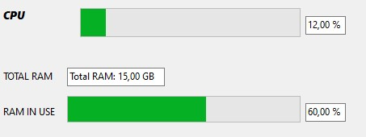
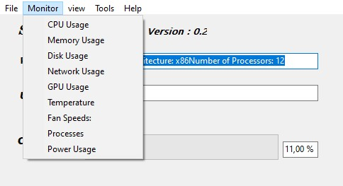

# ⚠️ Warning: not all functionalities are included in this version , They will be after updates finish

  # S.M.A  🚀🔧

This powerful tool is designed to provide real-time monitoring of various system metrics such as CPU usage, RAM usage, and system information. It features a user-friendly interface and dynamic visualizations to help you keep track of your system's performance efficiently.

 <!-- Replace with an actual screenshot -->

## Features 🌟

- **CPU Usage Monitoring** 🖥️
  - Real-time CPU usage displayed in a progress bar and percentage.
  - Visual graphs showing CPU usage trends.

- **RAM Usage Tracking** 💾
  - Real-time RAM usage displayed in a progress bar and percentage.
  - Detailed memory statistics including total and available memory.

- **System Information Display** 🛠️
  - Processor architecture and number of processors.
  - System information such as OS version and build.

- **User Information** 👤
  - Displays the current username of the logged-in user.

- **Real-time Graphs and Charts** 📊
  - Performance graphs showing CPU usage trends over time.

- **Interactive Components** 🖱️
  - Editable fields and interactive buttons for user actions.

# Installation and Setup 🚀
### Prerequisites

    Delphi or C++ Builder: To run or modify the source code.
    Windows OS: The application is designed to run on Windows.

Installation Steps

    Clone the Repository:

 

    git clone https://github.com/PanagiotisKots/System-Monitoring-Application.git

## Usage Guide 🛠️

### Main Window Overview

| Component         | Description                                           |
|-------------------|-------------------------------------------------------|
| **ProgressBar1**  | Displays real-time CPU usage as a percentage.        |
| **Edit3**         | Shows the CPU usage percentage in text format.       |
| **ProgressBar3**  | Shows real-time RAM usage as a percentage.           |
| **Edit5**         | Displays RAM usage percentage in text format.        |
| **Edit1**         | Shows detailed processor information.                |
| **Edit2**         | Displays the current user's name.                    |
| **Edit4**         | Shows total RAM memory available.                    |

## Screenshots 📸

### CPU Usage

| Component           | Description                        |
|---------------------|------------------------------------|
|  | Real-time CPU usage graph and progress bar. |

### RAM Usage

| Component           | Description                        |
|---------------------|------------------------------------|
|  | Real-time RAM usage graph and progress bar. |

### System Information

| Component           | Description                        |
|---------------------|------------------------------------|
|  | Detailed system and processor information. |

## Configuration Options ⚙️

### Timer Settings

- **Interval**: Determines how often the CPU and RAM usage is updated. Default is set to 3000 ms (3 seconds).

### Graph Customization

- **Color**: Set the line color for graphs to distinguish different data sets.
- **Line Width**: Adjust the width of the lines in graphs for better visibility.

### User Preferences

- **Dark Mode/Light Mode**: Toggle between dark and light themes to suit your visual preference.
- **Full-Screen Mode**: Enable or disable full-screen mode for a more immersive experience.

## Contributing 🤝

We welcome contributions to enhance the functionality and performance of the System Monitoring Program. To contribute:

1. **Fork the Repository**: Create your own copy of the repository.
2. **Create a Branch**: 

   git checkout -b feature/YourFeature

    Commit Your Changes:

git commit -am 'Add new feature'

Push to Your Branch:

    git push origin feature/YourFeature

    Submit a Pull Request: Open a pull request on GitHub for review.

# License 📜

This project is licensed under the MIT License - see the LICENSE file for details.
Contact 📧

For any inquiries or support, contact:

    Name: Panagiotis Kotsorgios
    Email: pkotsorgios654@gmail.com
    GitHub: https://github.com/PanagiotisKots

## Project Technologies and Tools Used 🛠️

This project leverages a variety of technologies and tools to deliver its functionalities. Here's an in-depth look at the key components:

                   

Explore these technologies and tools to understand how the System Monitoring Program integrates and utilizes them!

